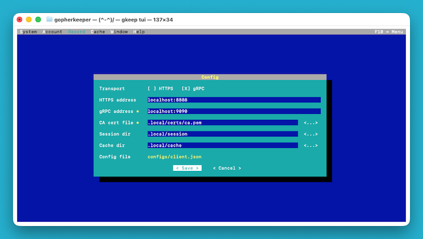
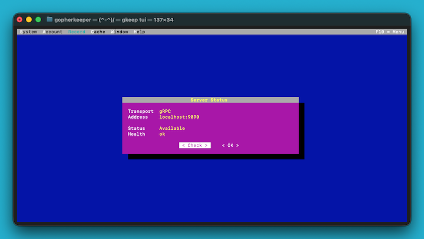
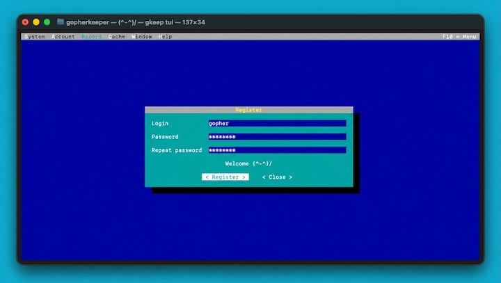
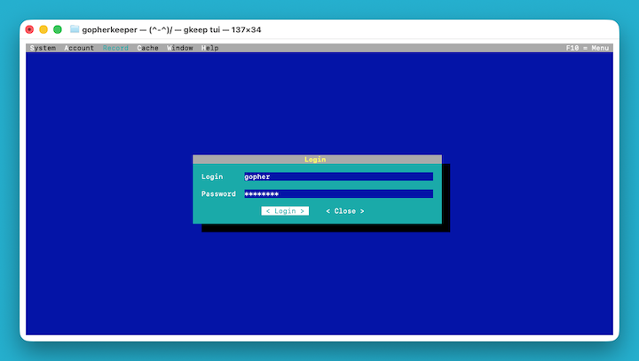
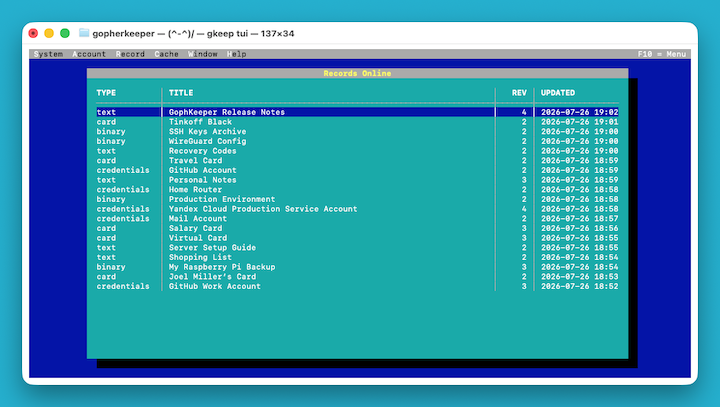
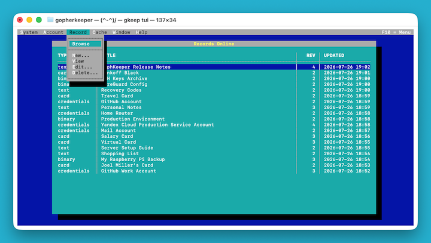
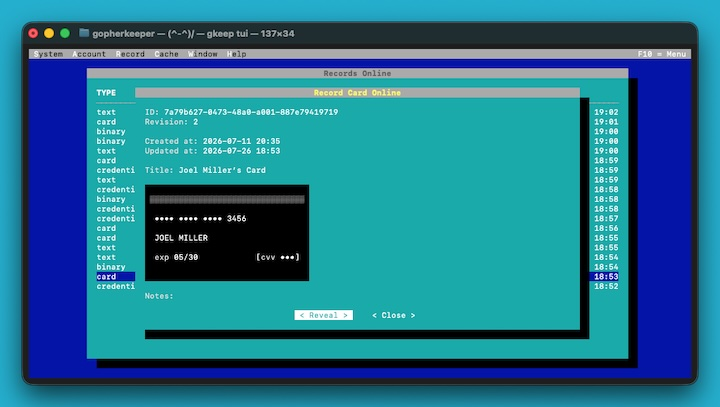
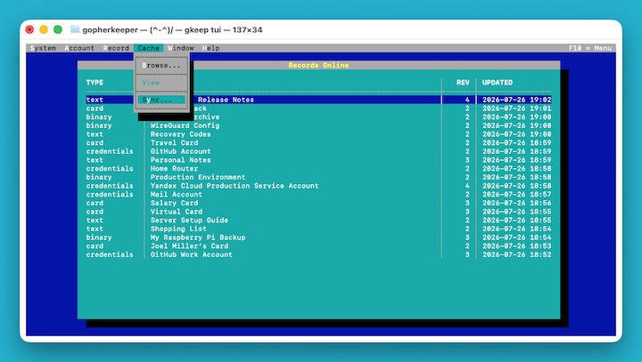
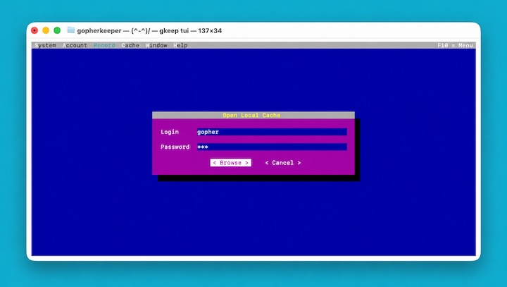

# 🔐 (^-^)/ GophKeeper. Менеджер паролей и приватных данных

[](https://github.com/xhrobj/gopherkeeper/actions/workflows/go-ci.yml) [](https://sonarcloud.io/summary/new_code?id=xhrobj_gophkeeper) [](https://sonarcloud.io/summary/new_code?id=xhrobj_gophkeeper)

**GophKeeper** — клиент-серверный менеджер паролей и приватных данных. Сервер хранит зашифрованные записи в PostgreSQL, а Клиент предоставляет отдельные CLI-команды и полнофункциональный терминальный интерфейс (TUI) с поддержкой HTTPS и gRPC поверх TLS.

[📝 Техническое задание](docs/SPECIFICATION.md) · [⚖️ Требования и ограничения](docs/PROJECT_REQUIREMENTS.md) · [🚀 Быстрый старт](docs/SETUP_QUICK.md) · [🤓 Полное руководство по настройке и запуску](docs/SETUP.md) · [💻 Консольный интерфейс](docs/CLI.md) · [OpenAPI](api/openapi.yaml)

## Возможности

GophKeeper поддерживает:

- подключение к Серверу через HTTPS или gRPC
- регистрацию, вход и завершение online-сессии
- проверку состояния Сервера и просмотр текущего пользователя
- создание, просмотр, редактирование и удаление записей типов `credentials`, `card`, `text` и `binary`
- явную синхронизацию зашифрованного локального кеша
- read-only просмотр ранее синхронизированных записей без доступного Сервера

Описание отдельных CLI-команд находится в [💻 руководстве по консольному интерфейсу](docs/CLI.md).

## Запуск TUI

Для быстрого старта используйте [🚀 краткий гайд по запуску](docs/SETUP_QUICK.md).

Подробная подготовка `.env`, JSON-конфига Клиента и локальных TLS-сертификатов описана в [🤓 полном руководстве по настройке и запуску](docs/SETUP.md).

После запуска Сервера и подготовки Клиента запустите TUI:

```bash
gkeep tui
```

Путь к конфигу при необходимости можно передать явно:

```bash
gkeep --config configs/client.json tui
```

Встроенный file/folder picker намеренно ограничен каталогом запуска Клиента и его подкаталогами: перейти выше этого каталога нельзя. Запускайте `gkeep tui` из каталога, содержащего доступные для выбора файлы и подкаталоги. Picker рассчитан на локальную файловую систему и не выполняет дополнительную проверку символических ссылок и специальных объектов.

## Краткий сценарий работы

### 1. Настройте подключение

Откройте `System → Config...`, выберите транспорт, укажите соответствующий адрес Сервера и путь к доверенному CA-сертификату. При необходимости настройте каталоги сессии и локального кеша.

<a href="docs/images/tui/01-config.png">
  
</a>

При запуске TUI с `--config` или `CONFIG` изменения сохраняются в тот же JSON-файл. Если путь к конфигу не передан, настройки действуют только до завершения текущего процесса.

### 2. Проверьте соединение

Откройте `System → Server Status`, чтобы проверить доступность Сервера и корректность TLS-настройки.

<a href="docs/images/tui/02-server-status.png">
  
</a>

### 3. Зарегистрируйтесь и войдите в аккаунт

Если у вас ещё нет аккаунта, выберите `Account → Register...`, укажите `Login` и `Password` и завершите регистрацию.

<a href="docs/images/tui/03-register.jpg">
  
</a>

После регистрации выберите `Account → Login...` и войдите с теми же `Login` и `Password`.

<a href="docs/images/tui/03-login.png">
  
</a>

### 4. Откройте серверные записи

После входа откройте меню `Records`. TUI загрузит актуальный список записей с Сервера.

<a href="docs/images/tui/04-records-online.png">
  
</a>

### 5. Работайте с записями

Через меню `Records` доступны просмотр, создание, редактирование и удаление записей типов `credentials`, `card`, `text` и `binary`.

<a href="docs/images/tui/05-record-menu.png">
  
</a>

<a href="docs/images/tui/06-card-view.jpg">
  
</a>

### 6. Синхронизируйте локальный кеш

Выберите `Cache → Sync...`, чтобы сохранить актуальные серверные записи в зашифрованном локальном кеше.

<a href="docs/images/tui/07-cache-menu.png">
  
</a>

### 7. Просматривайте записи без Сервера

Если Сервер недоступен, откройте `Cache → Browse...`.

Ранее синхронизированные записи доступны только для чтения и отражают состояние Сервера на момент последней успешной синхронизации.

<a href="docs/images/tui/08-cache-open.jpg">
  
</a>
